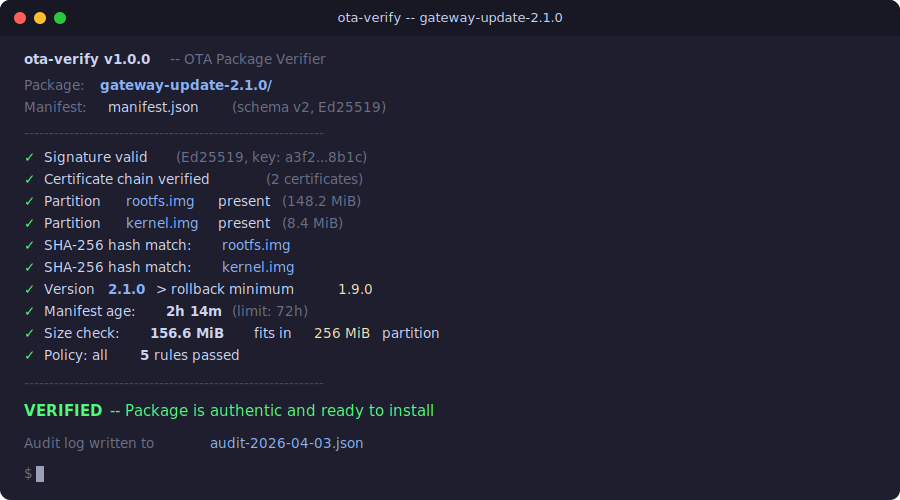

# ota-verify

[](https://github.com/isecwire/ota-verify/actions/workflows/ci.yml)
[](LICENSE)
[](https://www.rust-lang.org/)

**v1.0.0 — stable release**

<p align="center">
  
</p>

A command-line tool for verifying OTA (Over-The-Air) firmware update packages targeting embedded devices. It validates cryptographic signatures, manifest integrity, partition image hashes, and enforces A/B rollback safety constraints.

## Why OTA verification matters

Firmware updates are the most security-critical operation in an embedded device's lifecycle. A compromised update can brick devices at scale or install persistent backdoors that survive factory resets. `ota-verify` addresses this by enforcing a strict verification pipeline before any update is applied:

- **Multi-algorithm signatures** (Ed25519, RSA PKCS#1 v1.5 + SHA-256, ECDSA P-256) ensure the update was produced by an authorized build system.
- **SHA-256 hashes** detect corruption or tampering of individual partition images.
- **Version rollback checks** prevent downgrade attacks that re-introduce patched vulnerabilities.
- **Manifest expiry** limits the window in which a captured update package can be replayed.
- **Certificate chain verification** validates the signing key is authorized by a trusted CA.
- **Policy engine** enforces organizational security requirements beyond basic cryptographic checks.
- **Audit logging** produces structured JSON evidence for compliance and forensics.

## Features

### Cryptographic support

| Algorithm | Key generation | Signing | Verification |
|-----------|:-:|:-:|:-:|
| Ed25519 | Yes | Yes | Yes |
| RSA (PKCS#1 v1.5 + SHA-256, 2048-bit) | Yes | Yes | Yes |
| ECDSA P-256 | Yes | Yes | Yes |

The manifest can declare which algorithm was used via the `signature_algorithm` field. The verifier auto-detects the algorithm or accepts a CLI override. Certificate chain and key rotation metadata are supported for managed key lifecycle.

### Manifest schema versions

- **v1** (default): Core fields only -- version, device type, partitions, timestamp, battery, rollback.
- **v2**: Adds signature algorithm, device compatibility matrix, delta update metadata, install hooks, dependency chains, size constraints, key rotation, certificate chain, and extensible metadata.

V1 manifests are fully backward-compatible. New v2 fields are optional and default to `None`.

### Policy engine

Configurable verification policies loaded from JSON files. Policies can enforce:

- Required signature algorithm
- Maximum manifest age
- Minimum manifest schema version
- Device compatibility matrix presence
- Install hooks presence
- Key rotation metadata
- Certificate chain presence
- Minimum battery override
- Allowed device types whitelist
- Maximum total image size

### Audit logging

Every verification run can produce a structured JSON audit log recording each step's outcome, timing, and details. Designed for post-incident forensics and compliance evidence.

## A/B partition rollback

`ota-verify` is designed around the A/B partition scheme common in embedded Linux and Android systems. Each partition image in a manifest declares a `target_slot` (`slot_a`, `slot_b`, or `both`):

```
+------------------+      +------------------+
|     Slot A       |      |     Slot B       |
|  (active/boot)   |      |   (standby)      |
+------------------+      +------------------+
```

During an update, new images are written to the standby slot. The bootloader only switches the active slot after the new firmware passes a health check. If the new firmware fails, the device automatically rolls back to the previous slot with zero downtime.

## Installation

```bash
cargo install --path .
```

Or build from source:

```bash
cargo build --release
```

## Usage

### Generate a signing keypair

```bash
# Ed25519 (default)
ota-verify keygen --secret ota-secret.key --public ota-public.key

# RSA
ota-verify keygen --secret rsa-secret.key --public rsa-public.key --algorithm rsa

# ECDSA P-256
ota-verify keygen --secret ec-secret.key --public ec-public.key --algorithm ecdsa-p256
```

### Create a manifest

Create a `manifest.json` describing your update package. A v1 manifest:

```json
{
  "version": "2.4.1",
  "device_type": "isecwire-gateway-v3",
  "partitions": [
    {
      "name": "kernel.img",
      "hash_sha256": "a1b2c3...",
      "size": 4194304,
      "target_slot": "slot_b"
    },
    {
      "name": "rootfs.img",
      "hash_sha256": "d4e5f6...",
      "size": 67108864,
      "target_slot": "slot_b"
    }
  ],
  "timestamp": "2026-04-03T12:00:00Z",
  "min_battery": 25,
  "rollback_version": "2.3.0"
}
```

A v2 manifest with extended fields:

```json
{
  "manifest_version": 2,
  "version": "2.4.1",
  "device_type": "isecwire-gateway-v3",
  "signature_algorithm": "ed25519",
  "partitions": [
    {
      "name": "rootfs.img",
      "hash_sha256": "d4e5f6...",
      "size": 67108864,
      "target_slot": "slot_b",
      "delta": {
        "delta_base_version": "2.3.0",
        "patch_algorithm": "bsdiff"
      }
    }
  ],
  "timestamp": "2026-04-03T12:00:00Z",
  "min_battery": 25,
  "rollback_version": "2.3.0",
  "compatibility": {
    "hardware_revisions": ["v3", "v3.1"],
    "boot_rom_versions": ["1.2", "1.3"]
  },
  "hooks": [
    {
      "script": "pre_check.sh",
      "hash_sha256": "aabb...",
      "phase": "pre_install"
    }
  ],
  "dependencies": [
    {
      "version": "2.3.0",
      "component": "bootloader"
    }
  ],
  "target_partition_size": 134217728,
  "required_free_space": 10485760
}
```

### Sign the manifest

```bash
# Ed25519 (default)
ota-verify sign --manifest manifest.json --secret-key ota-secret.key --output manifest.sig

# RSA
ota-verify sign --manifest manifest.json --secret-key rsa-secret.key --output manifest.sig --algorithm rsa

# ECDSA P-256
ota-verify sign --manifest manifest.json --secret-key ec-secret.key --output manifest.sig --algorithm ecdsa-p256
```

### Verify the package

```bash
ota-verify verify \
  --manifest manifest.json \
  --package-dir ./package/ \
  --public-key ota-public.key \
  --signature manifest.sig \
  --max-age 72
```

With policy enforcement and audit logging:

```bash
ota-verify verify \
  --manifest manifest.json \
  --package-dir ./package/ \
  --public-key ota-public.key \
  --signature manifest.sig \
  --policy policy.json \
  --audit-log audit.json \
  --ca-key ca-public.key
```

### Batch verification

Verify multiple packages at once. Each subdirectory must contain `manifest.json`, `manifest.sig`, and the partition images:

```bash
ota-verify batch \
  --dir ./packages/ \
  --public-key ota-public.key \
  --max-age 72 \
  --policy policy.json
```

### Inspect / info

```bash
# Basic summary
ota-verify inspect --manifest manifest.json

# Detailed colored analysis
ota-verify info --manifest manifest.json
```

### Policy management

```bash
# Generate a default policy
ota-verify policy generate --output policy.json

# Generate a strict production policy
ota-verify policy generate --output policy.json --strict

# Validate a policy file
ota-verify policy validate --file policy.json

# Show formatted policy summary
ota-verify policy show --file policy.json

# Evaluate a policy against a manifest (dry-run, no signature check)
ota-verify policy evaluate --policy policy.json --manifest manifest.json
```

## Verification checks

| Check | Description |
|-------|-------------|
| Signature | Cryptographic signature over canonical manifest JSON (Ed25519 / RSA / ECDSA) |
| Certificate chain | Validate signing key chain to trusted CA |
| Partition files | All declared partition images exist in the package directory |
| SHA-256 hashes | Every partition image matches its declared hash |
| Rollback version | Package version is strictly greater than rollback version |
| Manifest expiry | Manifest timestamp is within the configured age limit |
| Size constraints | Total image + free space fits in target partition |
| Hook hashes | Install hook scripts match their declared SHA-256 hashes |
| Package simulation | File sizes match declarations, deployment feasibility check |
| Policy | All organizational policy rules are satisfied |

## Project structure

```
src/
  main.rs          -- CLI entry point and subcommand dispatch
  manifest.rs      -- OTA manifest types (v1/v2), serialization
  crypto.rs        -- Ed25519 operations, multi-algorithm dispatch
  rsa_signer.rs    -- RSA PKCS#1 v1.5 + SHA-256 operations
  ecdsa_signer.rs  -- ECDSA P-256 operations
  verifier.rs      -- Full verification pipeline with audit recording
  policy.rs        -- Configurable verification policy engine
  audit.rs         -- Structured JSON audit logging
  display.rs       -- Colored terminal output and formatted reports
  errors.rs        -- Error types
```

## Integration

`ota-verify` is designed to run as a pre-install gate in your device's update agent:

```bash
#!/bin/bash
set -e

# Download and extract the OTA package
extract_ota_package /tmp/update.tar.gz /tmp/ota/

# Verify before applying
ota-verify verify \
  --manifest /tmp/ota/manifest.json \
  --package-dir /tmp/ota/ \
  --public-key /etc/ota/public.key \
  --signature /tmp/ota/manifest.sig \
  --policy /etc/ota/policy.json \
  --audit-log /var/log/ota/audit-$(date +%s).json

# Only apply if verification passed
apply_update /tmp/ota/
```

## FAQ

### What problem does this solve?

When you update firmware on a remote device over the internet (OTA = Over-The-Air), someone could intercept and replace the update with malware. The device downloads the fake "update" and installs it. ota-verify prevents this.

### How does the verification work?

1. You have a **key pair**: private key (kept secret, in your build server) and public key (on every gateway)
2. Before sending an update, you **sign** it with the private key (like signing a check)
3. The gateway downloads the update and **verifies** the signature with the public key
4. If the signature doesn't match → update rejected
5. Additionally checks: SHA-256 hash of every file, version number (prevents rollback to older vulnerable version), manifest expiry time

### How to use it?

```bash
ota-verify keygen --algorithm ed25519           # generate key pair (once)
ota-verify sign --secret-key priv.key manifest.json  # sign before shipping
ota-verify verify --public-key pub.key package/      # gateway verifies before installing
```

## License

MIT -- see [LICENSE](LICENSE).
